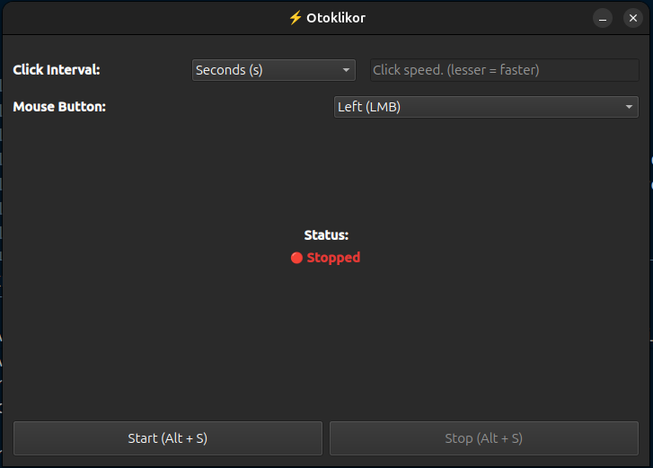
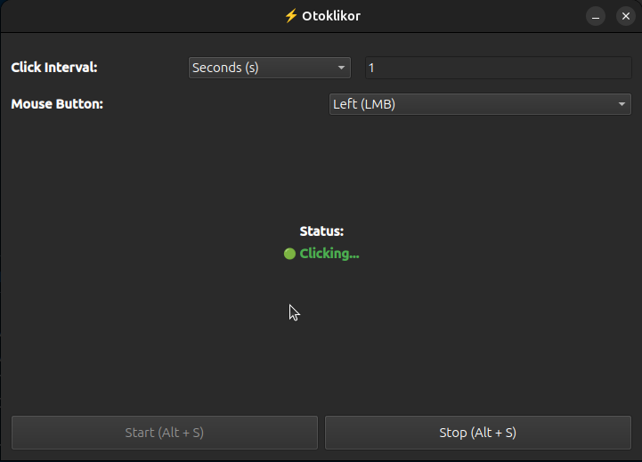

# 🖱️ Otoklikor — The Smart Autoclicker

Otoklikor is a **cross-platform autoclicker** built with **Python + PyQt**.  
It’s fast, lightweight, and gives you a sleek GUI to control automated mouse clicking.  
Perfect for testing, gaming, or any repetitive clicking task.

---

## 🚀 Features

- ✅ Clean **PyQt GUI** — visual start/stop indicator  
- ⚡ Multi-threaded clicking engine (no GUI freeze!)  
- 🎛️ Global hotkey toggle (e.g. press a key to start/stop)  
- 🧠 Safe threading: GUI updates happen on the main thread  
- 🐍 Pure Python
- 💥 Works on Linux, and Windows  

---

## 🧩 Demo

**First Look**



**App Running**



**Otoklikor Demo**


---

## 🖥️ Usage

1. **Clone the repo**
   ```bash
   git clone https://github.com/IshworTM/autoclicker-app.git
   cd autoclicker-app
   ```

2. **Setup a virtual environment**
    ```bash
    python3 -m venv venv-autoclicker
    source venv-autoclicker/bin/activate  # on Linux/macOS
    venv-autoclicker\Scripts\activate     # on Windows
    ```

3. **Install dependencies**
    ```bash    
    pip install -r requirements.txt
    ```

4. **Run the app**
    ```bash
    cd src
    python app.py
    ```

**You can also directly download the file from the releases tab, if you just want to use the app.**

## 🏗️ Contributing

Pull requests are welcome!
If you’ve got an idea to improve stability or make it better then fork it, do your thing, and open a PR.

## ⚖️ License

This project is licensed under the MIT License, so feel free to go wild, just don’t remove credit.